# 🛒 Online Shopping Portal - Marketeer


> A complete e-commerce solution built in PHP and MySQL featuring a **multi-vendor system** where sellers require admin approval. Hosted on InfinityFree.


##  Project Overview

The **Online Shopping Portal (Marketeer)** is a comprehensive e-commerce platform allowing customers to browse products, add them to a shopping cart, and securely purchase items. It includes dedicated admin and seller dashboards — with seller registration requiring admin approval.

---

## 🔐 Admin Login Credentials
Username: Admin
Password: Test@123


> You can change these credentials in your admin user table inside the MySQL database.

---

## Key Features

### Customer
- User Registration / Login
- Profile & Address Management
- Password Reset & Update
- Shopping Cart & Wishlist
- Checkout & Order History

### Admin
- Product Management (Add, Edit, Delete)
- Order Management (View & Update Orders)
- User Management (Approve/Block/Delete)
- Category/Subcategory Management
- Seller Approval System

###  Seller
- Seller Registration + Business Details
- Admin Approval Required
- Once Approved: Access Seller Dashboard
- Add, Edit, and Manage Own Products
- View Sales and Order Data

---

## 🧪 Tech Stack

| Layer       | Technologies                        |
|-------------|-------------------------------------|
| **Frontend** | HTML, CSS, JavaScript, jQuery, AJAX |
| **Backend**  | PHP 5.6 / 7.x / 8.x                |
| **Database** | MySQL 5.x / 8.x                    |
| **Server**   | Apache (XAMPP)                     |
| **Hosting**  | InfinityFree                       |

---

## 🖼️ Screenshots

> Place your screenshots inside an `images/` folder and update these links accordingly.

### 🏠 Home Page


### 🏠 Landing Page
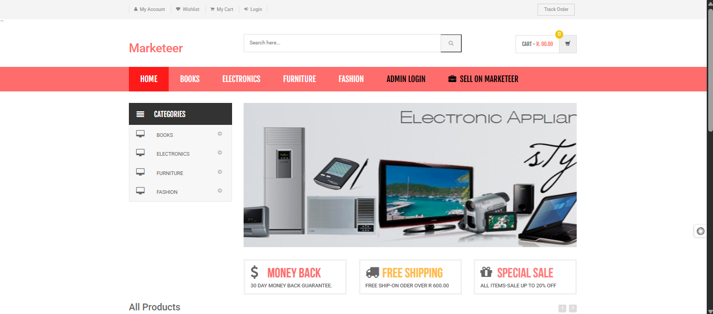
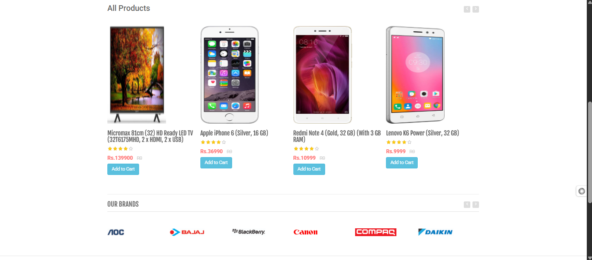
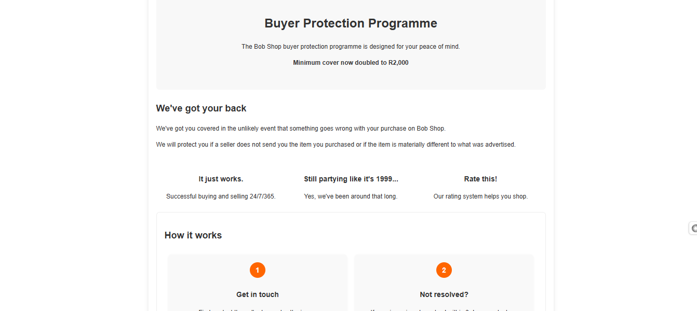

## Customer side
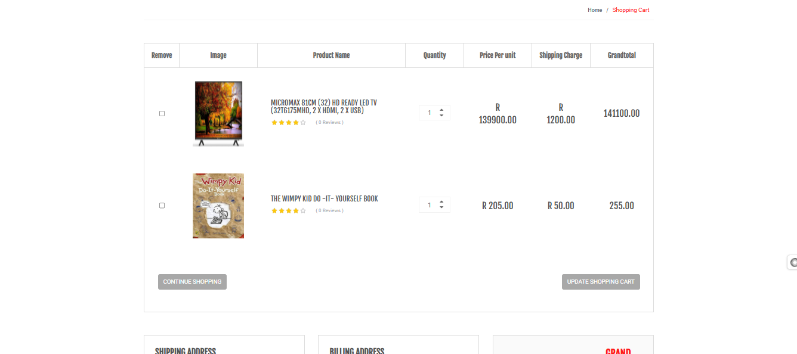
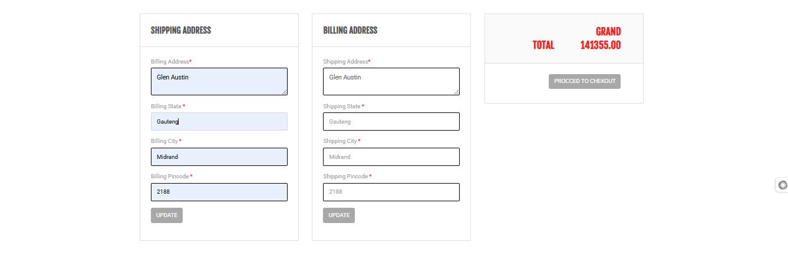
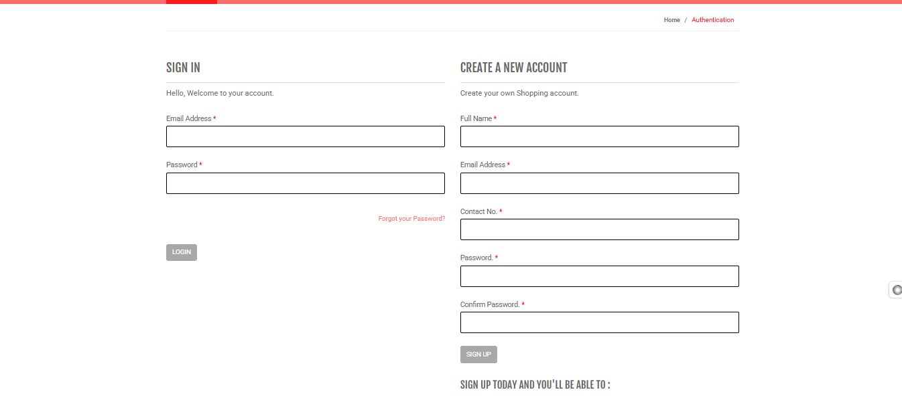


## Order Trcak
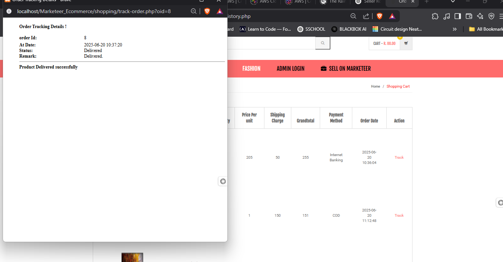
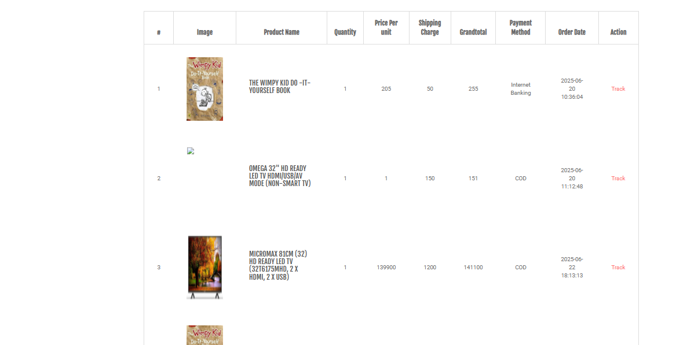

## Payment


### 🔐 Admin Login
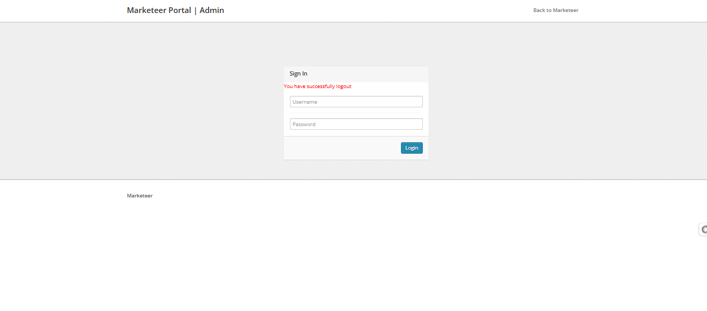

### 🔐 Admin Dashboard


### 🔐 Admin Order Management
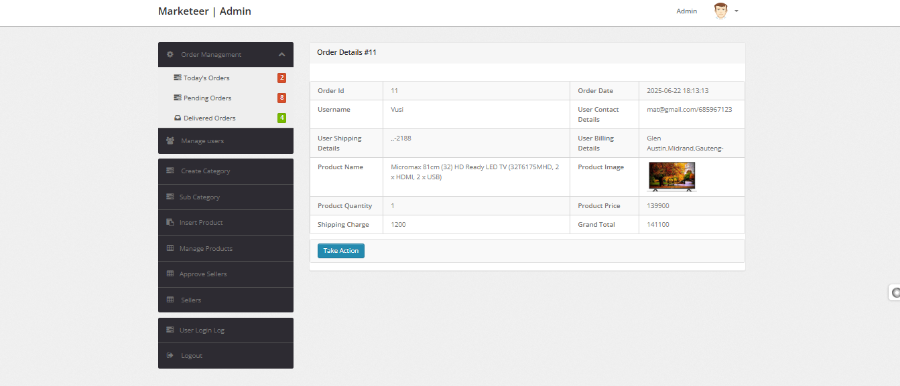

### 🔐 Admin Approve sellers
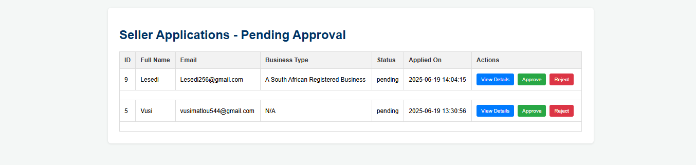

### 🔐 Admin Approved sellers
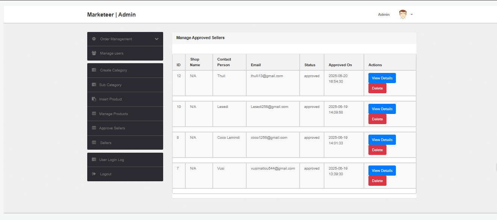


### 🛍️ Seller Dashboard
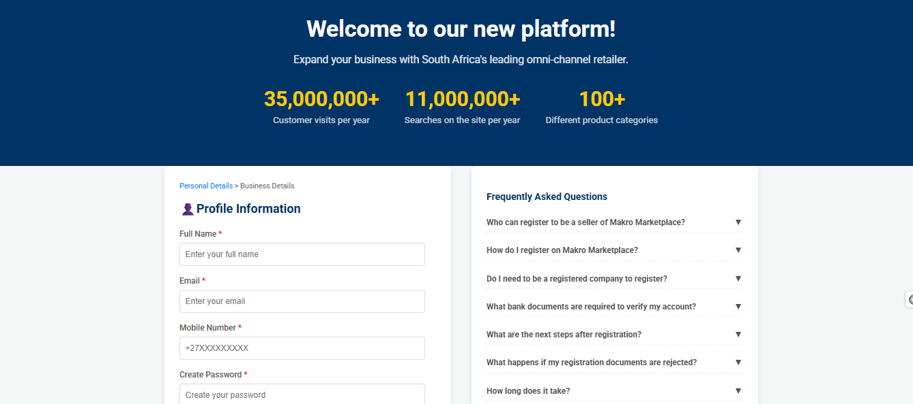

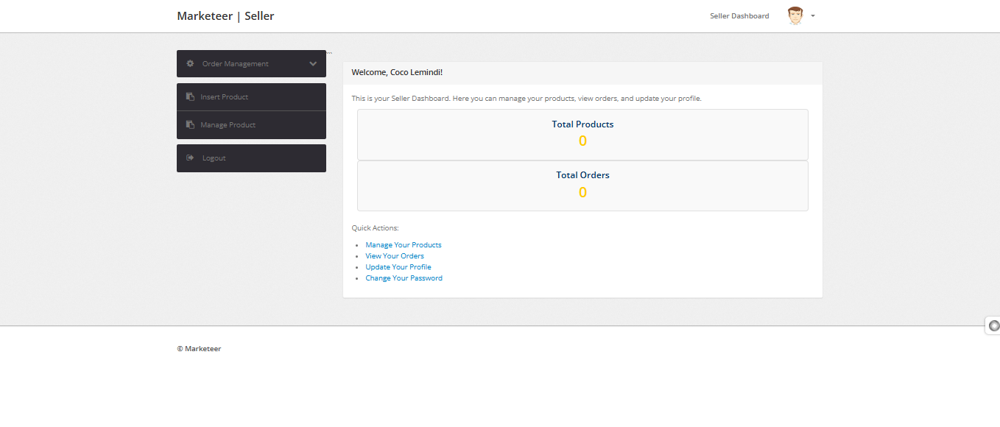
---

## ⚙️ Installation & Setup

### 1. Clone the Repository

```bash
git clone https://github.com/Vusi-Kunene-Matlou/Marketeer_Ecommerce.git
cd Marketeer_Ecommerce

🌐 Usage
👤 Customers
Register, log in, shop, checkout, view order history

🧑 Sellers
Apply to become a seller

Wait for admin approval

Once approved, log in to manage your products

👑 Admin
Access via: http://localhost/Marketeer_Ecommerce/admin/

Use provided credentials to manage the platform


